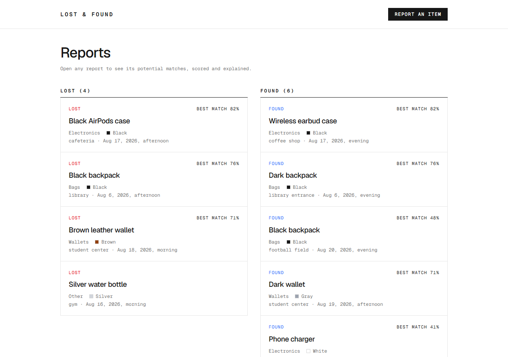
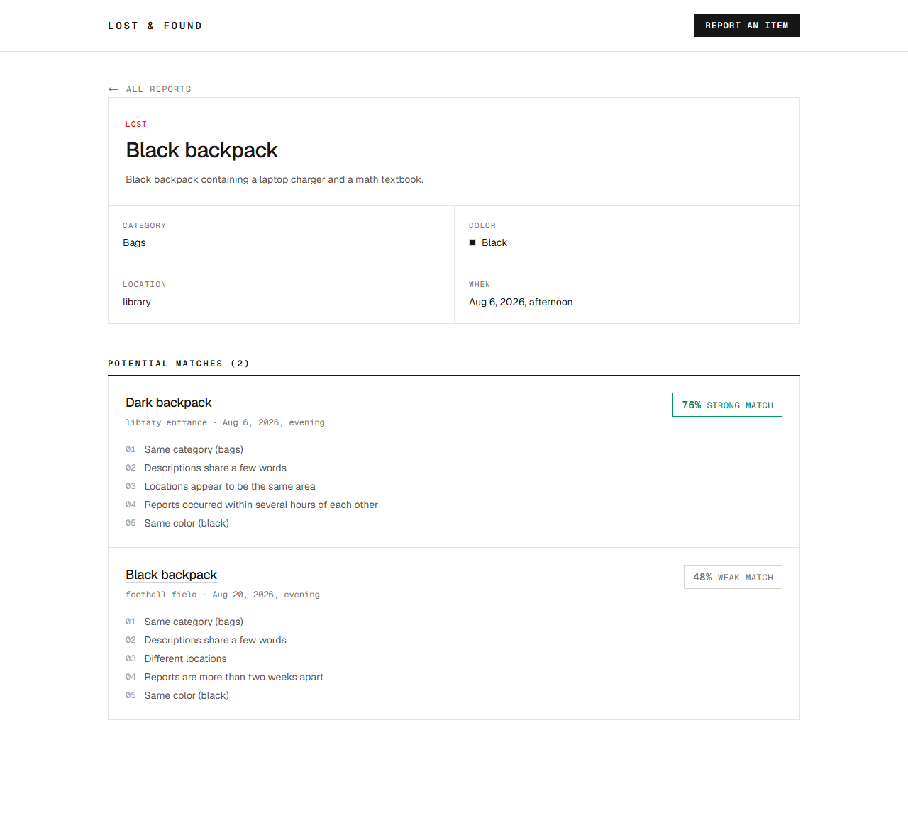
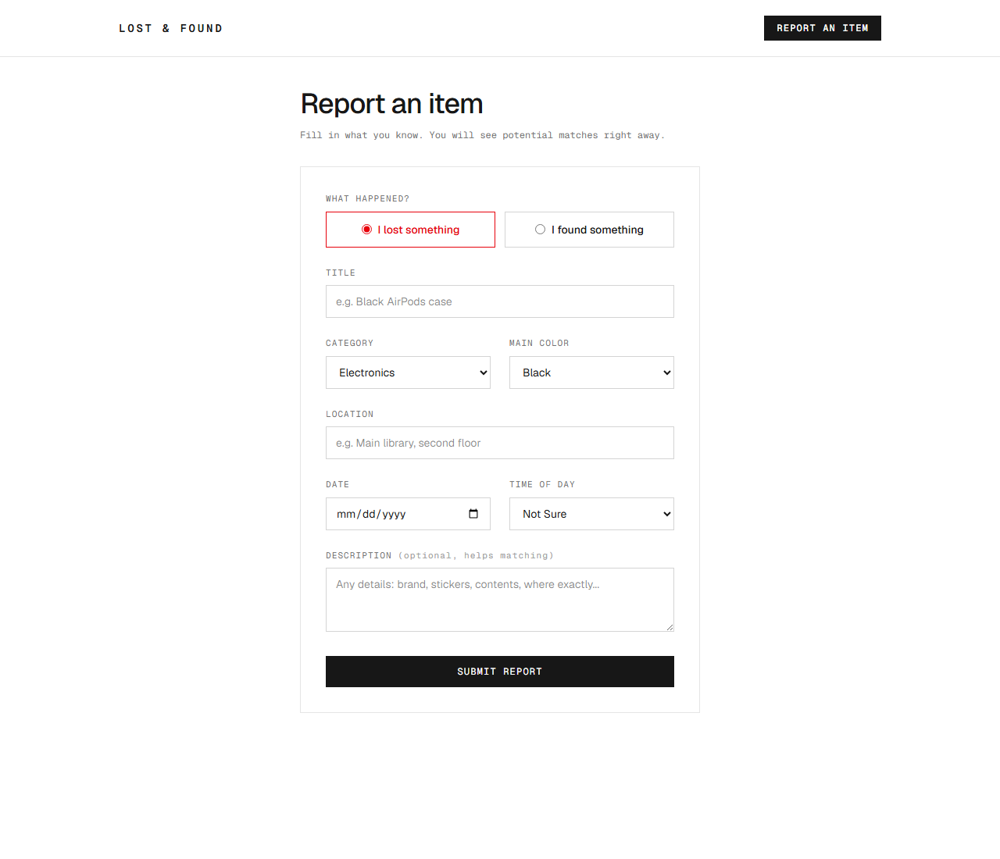

# Lost & Found Matcher

A small app for a university lost-and-found. Students file lost or found reports, and the app surfaces potential matches between them with a score and a plain-English explanation of why.

## Screenshots

| Reports overview | Match results | New report form |
| --- | --- | --- |
|  |  |  |

## Running it

Requires Node 20 or newer.

```bash
npm install
npx prisma migrate dev   # creates the SQLite database
npm run db:seed          # optional: loads 10 sample reports
npm run dev
```

Open http://localhost:3000. Run the tests with `npm test`.

## Approach

I kept the product surface at the assessment minimum (create reports, see matches) and spent the effort on the matching engine. The engine is a pure TypeScript module with no dependencies on the framework or the database, so all matching behavior is covered by fast unit tests. Matches are computed on demand when you open a report, not stored, which keeps them deterministic and always in sync with the data.

Reports capture structured fields (category, color, date, time of day) through dropdowns instead of parsing everything out of free text. That is a product decision: constraining input where users can be constrained makes matching far more reliable, and the free-text title, description and location still carry the nuance.

## How matching works

A lost report is compared to every found report (and vice versa). Each pair gets a weighted score out of 100:

| Signal | Weight | How it is compared |
| --- | --- | --- |
| Category | 30 | Exact match of the selected category |
| Title + description | 25 | Token overlap (Dice coefficient) after normalization |
| Location | 20 | Same token overlap on the location text |
| Date and time | 15 | Hours apart, decaying linearly to zero at two weeks |
| Color | 10 | Exact match, or partial credit for confusable pairs like brown and beige |

Text comparison normalizes case and punctuation, drops stopwords, singularizes plurals, tolerates one typo in longer words, and maps a deliberately small set of synonyms to one canonical token (airpods/earbuds/headphones, backpack/rucksack/bag, cafeteria/cafe/coffee, dark/black, and so on). The synonym list is small on purpose: it covers the vocabulary that actually shows up in campus reports and stays easy to audit.

Three rules sit on top of the weighted sum:

- **Category mismatch caps the score at 45.** Without it, a red umbrella and a red backpack in the same place on the same day would score deceptively high on location, date and color alone.
- **Items found more than a day before they were reported lost get their date score halved.** Time flowing the wrong way is evidence against a match, not just distance.
- **Unknown color scores a neutral 0.5, not 0 and not 1.** Missing information is uncertainty, and two unknown colors are not an agreement.

Scores of 75+ are labeled strong, 50 to 74 possible, 30 to 49 weak, and anything below 30 is not shown. Every component contributes one human-readable reason, so a result looks like:

```
82% Strong match
- Same category (electronics)
- Descriptions share several details
- Locations appear to be the same area
- Reports occurred within several hours of each other
- Same color (black)
```

The seed data recreates the scenarios from the brief: the AirPods case scores 82 (strong), the backpack found near the library the same evening scores 76 (strong), the same backpack found at the football field two weeks later scores 48 (weak, shown but flagged), a wallet with a color disagreement lands at 71 (possible), and a water bottle and an umbrella match nothing.

## Assumptions

- Reports are compared as one pool. There is no cleanup or expiry of old reports.
- The date on a report is when the item was lost or found, not when the report was filed.
- A found report dated long before a lost report is probably a different item, hence the penalty.
- Category and color come from fixed lists. "Other" and "unknown" exist so users are never forced to lie, and both are treated as weak signals rather than exact matches.
- Anyone can see all reports. A real deployment would need contact or claim flows, which are out of scope here.

## Technical decisions

- **Next.js App Router with server components and server actions.** The app has three pages and one mutation, so this needs no API layer and no client state library.
- **Prisma with SQLite.** Zero-setup local persistence. The schema is one model. SQLite has no enums, so type, category and time period are validated strings (zod on the way in).
- **Matching is O(lost x found) on every view.** At campus scale (hundreds of reports) this is microseconds. I would only precompute or index if the pool grew by orders of magnitude.
- **Pinned Prisma 6 rather than 7.** Prisma 7 requires driver adapters and extra configuration for SQLite; v6 keeps a clean install to two commands.
- **Vitest for the matching engine only.** The engine holds all the logic worth testing. UI tests would mostly re-test the framework.
- **Visual design.** The UI follows the flat editorial grid style of the sites curated in [Siteinspire's grid-layout collection](https://www.siteinspire.com/websites/category/grid-layout): hairline borders, monospaced metadata, uppercase micro labels, and no decorative chrome, so the match scores and reasons carry the page.

## What I intentionally did not build

Authentication, accounts, notifications, maps, photo uploads, chat, claim workflows, admin tooling, pagination, and any LLM or external API in the matching path. Matching runs entirely locally and deterministically: the same two reports always produce the same score and the same reasons.

## What I would improve as a real product

- Feedback loop: let staff confirm or reject suggested matches, then learn the weights from those outcomes the way probabilistic record linkage tools do (the Fellegi-Sunter model behind Splink is the natural upgrade path for this kind of weighted field comparison), instead of setting them by intuition.
- A proper location model: named campus places with aliases and adjacency (library and library entrance should be more than a string overlap).
- Embedding-based text similarity (still local, e.g. a small sentence-transformer) once real descriptions prove too varied for token overlap.
- Report lifecycle: resolve or expire reports so the pool stays clean, plus rate limiting and moderation for abuse.
- Accessibility pass and mobile testing beyond the basics.

## AI usage

I used Claude for pair programming on this project: scaffolding the UI, drafting the matching engine to my design, and generating the first pass of the test suite. The scoring model itself (the weights, the category cap, the found-before-lost penalty and the neutral handling of unknowns) came out of working through the brief's examples by hand. I reviewed everything, adjusted seed data and thresholds after checking real scores, and fixed edge cases the first version got wrong (numeric tokens were being dropped, and two unknown colors counted as a color match).
